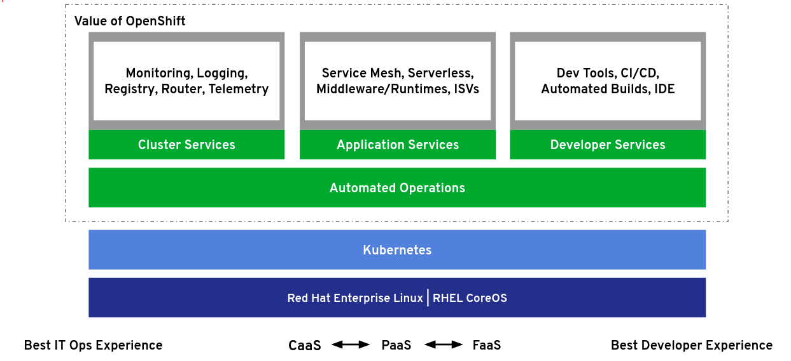
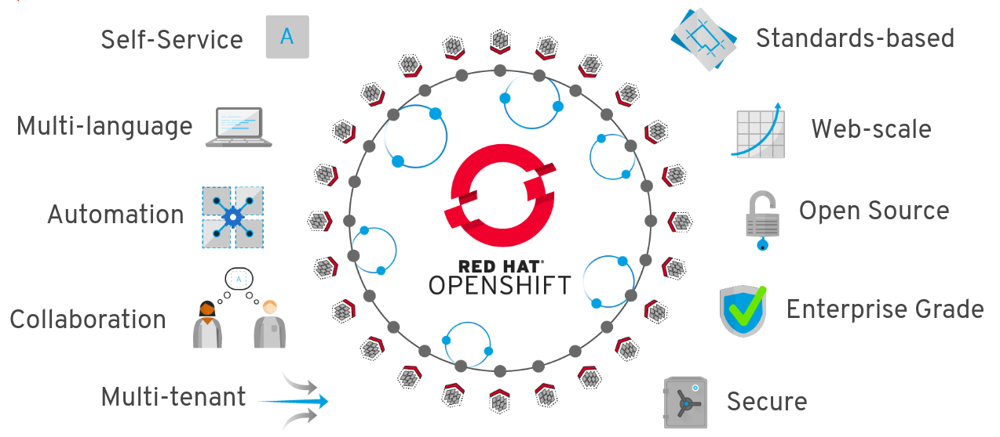

# Afinal, o que é OpenShift

Apesar da aparente simplicidade de operar containers, operacionaliza-los em produção requer uma plataforma capaz de resolver as questões como: orquestração de Rede, armazenamento Persistente, registro Privado, portal de Auto-Consumo, controle de Acesso e Quotas, gestão de Ciclo de Vida...

Construído no Red Hat Enterprise Linux, Docker e Kubernetes, o OpenShift fornece um sistema operacional seguro e escalável para os aplicativos corporativos atuais independente da sua arquitetura, ao mesmo tempo em que fornece tempo de execução e bibliotecas integradas. O OpenShift traz uma plataforma de contêiner robusta, flexível e escalável para os data centers de clientes, permitindo que as organizações implementem uma plataforma que atenda aos requisitos de segurança, privacidade, conformidade e governança, além da implantação dos apps em praticamente qualquer infraestrutura, seja ela publica ou privada.

**Próximo:** [Componentes e arquitetura básica](/openshift-basico/comp-arqui)
